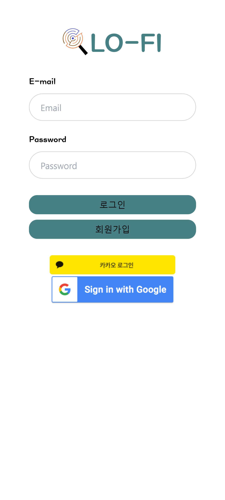
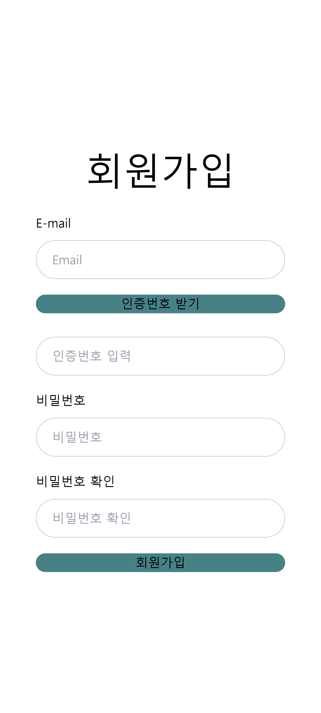

# LO-FI 

#### 잃어버린 모든것을 찾아드립니다


## 📅 **프로젝트 진행 기간**

220208.29(월) ~ 2022.10,07(금) (38일간 진행)

SSAFY 7기 2학기 특화프로젝트 - LO-FI


## 🎒 LO-FI **- 배경**

분실물과 유기동물, 실종자 등등 주변에 잃어버리는 것들은 많지만 막상 찾으려니 어디에 글을 써야할지 어딜가야 찾을 수 있을지 난감하신가요?

저희 LO-FI는 자신 주변의 데이터를 보여주어 이용자들이 보다 빠르게 물건을 되찾을 수 있도록 하는 서비스 입니다!


## 👓LO-FI 서비스 화면

#### 로그인



#### 회원가입



#### 메인페이지


#### 검색페이지


#### 등록페이지


## 🧡 **주요 기능**

- 로그인
  - 복잡한 정보없이 이메일만 입력하여 회원가입 할 수 있습니다.
  - 간편하게 소셜로그인으로 귀찮은 회원가입 절차없이 로그인 할 수 있습니다.

- 주변 데이터 조회
  - 유저 중심으로 반경 1km 데이터만 지도에 표시됩니다!
  - 구태여 검색할 필요없이 주변의 데이터를 찾아볼 수 있어요
  - 자신이 분신물을 습득하였다면 등록된 전화번호나 이메일을 통해서 바로 관계자에게 연락할 수 있어요
  
- 키워드 검색
  - 키워드를 이용하여 자신이 찾고있는 물품을 검색할 수 있습니다.
    - ex) 아이폰 13 블랙
    
  - 해당하는 키워드를 가진 데이터가 검색됩니다.
    - 이때는 모든 지역을 기준으로 검색됩니다.
    
      

## ⭐기술 특이점

- hadoop

- 맞춤법 검사기

  불특정 다수가 입력한 데이터라 외래어 같은 경우 사람마다 작성하는 방법이 다르고 오타도 많아 맞춤법 검사기로 한번 전처리를 하고나서 자연어 처리를 실시하였습니다.

- 자연어처리

- s3

  프론트엔드에서 사진을 등록할 때 백엔드에 저장되지 않고 s3 버킷에 저장하여 저장된 url를 백엔드에 넣는 것으로 이미지 저장문제를 해결했습니다.


## 📂프로젝트 파일구조

**BackEnd**

```
BE
  ├── Tracing
  ├── accounts
  │   ├── kakao_key
  │   └──  tests
  ├── apiserver
  │   └──  settings
  ├── blacklists
  ├── categorys
  │   └── dumpdata
  ├── crews
  │   └── serializer
  ├── csv_to_db
  ├── media
  │   ├── basic
  │   ├── crew/image
  │   ├── store/logo
  │   └── user/profile
  ├── notification
  ├── review
  │   ├── dumpdata
  │   └── serializers
  ├── static
  └── stories
			 └── serializers
```

**FrontEnd**

```
lo-fi
  ├── node_modules
  ├── public
  └── src
      ├── api
      │   ├── axios
      │   └── requests
      ├── assets
      │   ├── fonts
      │   └── icons
      ├── components
      ├── hooks
      ├── router
      ├── pages
      │   ├── loginPage
      │   ├── registerPage
      │   ├── MainPage
      │   ├── SearchPage
      │   ├── DetailPage
      │   ├── addPage
      │   └── ProfilePage
      └── redux/modules
					└── index.js
```


## **✔ 협업 툴**

------

- Git
- Notion
- JIRA
- MatterMost
- Webex

## **✔ 협업 환경**

------

- Gitlab
  - 각자 브랜치를 따로 파서 기능 작성
  - 코드의 버전을 관리
  - 이슈 발행, 해결을 위한 토론
  - MR시, 팀원이 코드리뷰를 진행하고 피드백 게시
- JIRA
  - 매주 목표량을 설정하여 Sprint 진행
  - 업무의 할당량을 정하여 Story Point를 설정하고, In-Progress -> Done 순으로 작업
- 스크림
  - 데일리 스크림을 진행하여 아이스 브레이킹과 그날 하루 해야될 진행목표를 공유
  - 다같이 공유해야 되는 공지사항과 Todo를 작성하여 데일리 목표를 정함
- Notion
  - 회의가 있을때마다 회의록을 기록하여 보관
  - 기술확보 시, 다른 팀원들도 추후 따라할 수 있도록 보기 쉽게 작업 순서대로 정리
  - 컨벤션 정리
  - 스토리보드, 기능명세서, ERD 등 모두가 공유해야 하는 문서 관리
  - 회고록을 작성하여 진행하면서 막힌 부분과 돌아볼 점을 정리