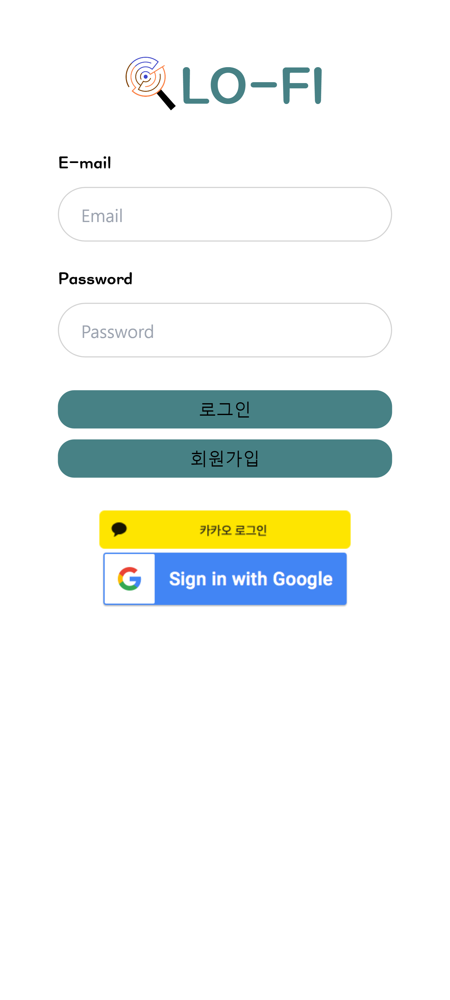

## 시나리오

**회원가입**

- 이메일 인증을 통해서 추후에 유저가 등록한 게시물 신고를 메일로 받아 볼 수 있습니다.

**로그인**

- 카카오와 구글의 소셜로그인이 가능합니다

**메인화면**

- 자기 위치를 기준으로 1km 이내의 데이터를 지도에 표시합니다
- 마커를 클릭하면 해당 데이터의 정보를 간략하게 볼 수 있습니다
- 위에 카테고리 버튼을 통해서 보여지는 정보를 바꿀 수 있습니다.
- 위에 검색창을 통해 키워드 검색을 실시하여 원하는 정보를 찾을 수 있습니다
- 상단의 목록탭을 통해서 보이는 화면을 바꿀 수 있습니다.

**상세페이지**

- 해당 데이터의 상세 정보를 볼 수 있습니다.
- 지도보기를 통해 해당데이터의 위치를 자세하게 볼 수 있습니다.
- 하단의 신고 버튼을 통해서 등록한 유저와 연락할 수 있습니다.

**등록페이지**

- 푸터바의 `+` 를 통해서 원하는 카테고리를 선택하여 데이터를 등록할 수 있습니다.
- 사진은 최대 3개 까지 등록가능합니다.
- 위치 정보는 카카오 api를 사용하여 등록하였고 위경도도 같이 넘어가서 보다 정확한 위치를 확인할 수 있습니다.

**마이페이지**

- 자신이 작성한 글을 볼 수 있습니다
- 로그아웃을 할 수 있습니다.
- 자신의 point를 확인할 수 있습니다.

## 시나리오(with Screenshot)

#### 회원가입

#### 로그인

#### 메인페이지

#### 등록페이지

#### 검색페이지

#### 상세페이지

#### 마이페이지

